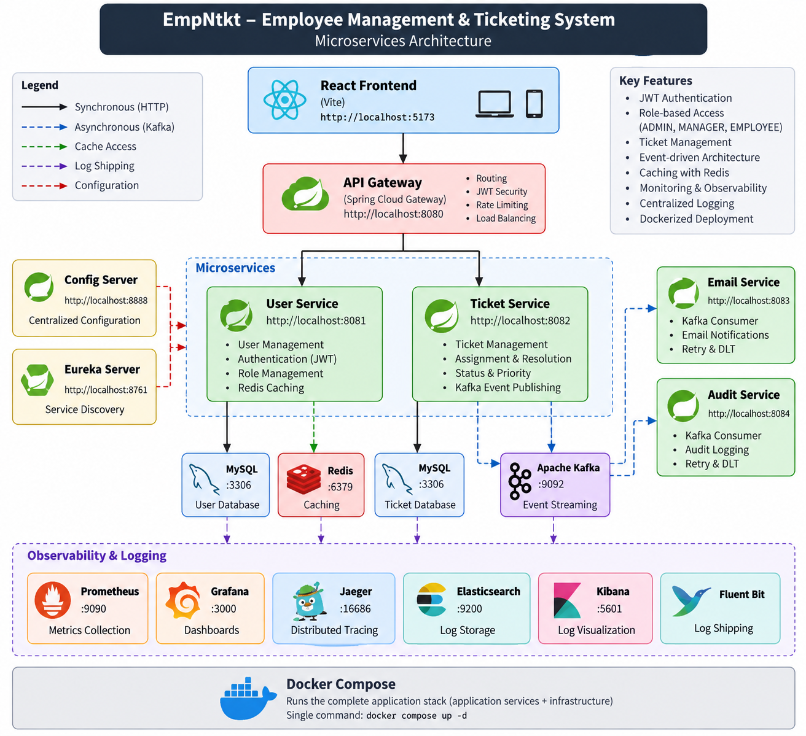

# EmpNtkt — Employee Management & Ticketing System

A production-style **Employee Management & Ticketing System** built using Spring Boot microservices, React, Kafka, Redis, JWT authentication, and Docker.

The system supports role-based access for **ADMIN, MANAGER, and EMPLOYEE**, ticket creation and assignment, event-driven notifications, audit logging, caching, monitoring, distributed tracing, and centralized log management.

---

## 🚀 Features

- JWT-based authentication
- Role-based authorization (ADMIN, MANAGER, EMPLOYEE)
- Employee registration
- Admin can create managers
- Ticket creation, assignment, resolution, and closure
- Ticket status and priority management
- Redis caching
- Kafka event-driven communication
- Email notifications
- Audit logging
- Kafka retry and Dead Letter Topic (DLT)
- API Gateway
- Service discovery with Eureka
- Centralized configuration with Spring Cloud Config
- Rate limiting for ticket APIs
- Prometheus metrics
- Grafana dashboards
- Distributed tracing with Jaeger
- Elasticsearch + Kibana centralized logs
- Fluent Bit log shipping
- Dockerized full-stack deployment
- React frontend

---

## 🏗️ Architecture


```
                         ┌──────────────────┐
                         │   React Frontend │
                         │      :5173       │
                         └────────┬─────────┘
                                  │
                                  ▼
                         ┌──────────────────┐
                         │   API Gateway    │
                         │      :8080       │
                         └────────┬─────────┘
                                  │
                 ┌────────────────┴────────────────┐
                 │                                  │
                 ▼                                  ▼
        ┌─────────────────┐              ┌─────────────────┐
        │  User Service   │              │ Ticket Service  │
        │      :8081      │              │      :8082      │
        └────────┬────────┘              └────────┬────────┘
                 │                                 │
                 └──────────────┬──────────────────┘
                                 │
                     ┌───────────┴───────────┐
                     │                       │
                     ▼                       ▼
               ┌──────────┐            ┌──────────┐
               │  MySQL   │            │  Redis   │
               │  :3306   │            │  :6379   │
               └──────────┘            └──────────┘

                          Kafka :9092
                              │
             ┌────────────────┼────────────────┐
             │                │                │
             ▼                ▼                ▼
       Email Service    Audit Service     Other Events
          :8083             :8084

       ┌──────────────────────────────────────────────┐
       │                Infrastructure                 │
       │                                                │
       │ Config Server :8888     Eureka :8761           │
       │ Prometheus :9090        Grafana :3000          │
       │ Jaeger :16686           Elasticsearch :9200    │
       │ Kibana :5601            Fluent Bit             │
       └──────────────────────────────────────────────┘
```

---

## 🧩 Microservices

| Service | Port | Responsibility |
|---|---|---|
| API Gateway | 8080 | Entry point, routing, JWT security, rate limiting |
| User Service | 8081 | Users, authentication, roles |
| Ticket Service | 8082 | Ticket creation, assignment, resolution and closure |
| Email Service | 8083 | Kafka-based email notifications |
| Audit Service | 8084 | Ticket audit/event persistence |
| Config Server | 8888 | Centralized configuration |
| Discovery Server | 8761 | Eureka service discovery |

---

## 🔐 Authentication & Authorization

The application uses Spring Security + JWT.

**Authentication flow:**

```
User
  │
  ▼
POST /auth/login
  │
  ▼
API Gateway
  │
  ▼
User Service
  │
  ▼
JWT Token
  │
  ▼
Frontend
```

The frontend stores the JWT and sends it with subsequent requests:

```
Authorization: Bearer <JWT>
```

### Roles

**ADMIN**
- Create managers
- Access administrative functionality
- Manager-level access

**MANAGER**
- View unassigned tickets
- Assign tickets to employees
- View resolved tickets
- Close tickets

**EMPLOYEE**
- Create tickets
- View created tickets
- View assigned tickets
- Resolve assigned tickets

---

## 🎫 Ticket Workflow

```
                    ┌─────────────┐
                    │   CREATE    │
                    └──────┬──────┘
                           │
                           ▼
                    ┌─────────────┐
                    │    OPEN     │
                    └──────┬──────┘
                           │
                     Manager assigns
                           │
                           ▼
                    ┌─────────────┐
                    │  ASSIGNED   │
                    └──────┬──────┘
                           │
                    Employee resolves
                           │
                           ▼
                    ┌─────────────┐
                    │  RESOLVED   │
                    └──────┬──────┘
                           │
                     Manager closes
                           │
                           ▼
                    ┌─────────────┐
                    │   CLOSED    │
                    └─────────────┘
```

---

## 📨 Kafka Event-Driven Architecture

Ticket events are published through Apache Kafka.

```
Ticket Service
      │
      │ TicketCreatedEvent
      ▼
    Kafka
   /     \
  ▼       ▼
Email    Audit
Service  Service
```

**Email Service** — Consumes ticket events and sends email notifications.

**Audit Service** — Consumes ticket events and stores audit records.

**Reliability** — Kafka consumers use retry handling and a Dead Letter Topic (DLT) for failed message processing.

---

## ⚡ Redis Caching

Redis is used for caching frequently accessed user information.

```
Request
   │
   ▼
User Service
   │
   ▼
Redis Cache
   │
   ├── Cache Hit ──────► Return cached data
   │
   └── Cache Miss
          │
          ▼
        MySQL
          │
          ▼
     Store in Redis
```

---

## 📊 Observability

The project includes a complete observability stack.

| Tool | Purpose | URL |
|---|---|---|
| Prometheus | Collects application metrics | http://localhost:9090 |
| Grafana | Metrics visualization and dashboards | http://localhost:3000 |
| Jaeger | Distributed request tracing across microservices | http://localhost:16686 |
| Elasticsearch | Centralized application logs | http://localhost:9200 |
| Kibana | Log discovery UI | http://localhost:5601 |
| Fluent Bit | Collects application logs and forwards them to Elasticsearch | — |

---

## 🐳 Docker

The entire application can be started using Docker Compose.

### Prerequisites
- Docker Desktop
- Git

No local installation of MySQL, Redis, Kafka, Elasticsearch, etc. is required when using the Docker setup.

### Environment Variables

Sensitive configuration is stored locally in `.env`.

Example:

```
MYSQL_ROOT_PASSWORD=your_password
MYSQL_USER=root
```

`.env` is intentionally excluded from Git.

### Start the application

```bash
docker compose up -d
```

Check running containers:

```bash
docker compose ps
```

### Stop the application

```bash
docker compose down
```

Persistent Docker volumes are used for databases and monitoring data.

---

## 🌐 Application URLs

| Component | URL |
|---|---|
| Frontend | http://localhost:5173 |
| API Gateway | http://localhost:8080 |
| User Service | http://localhost:8081 |
| Ticket Service | http://localhost:8082 |
| Email Service | http://localhost:8083 |
| Audit Service | http://localhost:8084 |
| Eureka | http://localhost:8761 |
| Config Server | http://localhost:8888 |
| Prometheus | http://localhost:9090 |
| Grafana | http://localhost:3000 |
| Jaeger | http://localhost:16686 |
| Elasticsearch | http://localhost:9200 |
| Kibana | http://localhost:5601 |

---

## 🖥️ Frontend

The frontend is built with:

- React
- Vite
- Axios
- React Router
- JWT authentication

The UI provides separate experiences for:

**Employee**
- Dashboard
- My Tickets
- Create Ticket

**Manager**
- Manager Dashboard

**Admin**
- Admin Dashboard

The production frontend is served through Nginx inside Docker.

---

## 📁 Project Structure

```
EmpMngmntAndTktingSys/
│
├── api-gateway/
├── audit-service/
├── common-events/
├── config-server/
├── discovery-server/
├── email-service/
├── ticket-service/
├── user-service/
│
├── frontend/
│
├── monitoring/
│
├── docker-compose.yml
├── .gitignore
├── .env
└── README.md
```

---

## 🛠️ Technology Stack

**Backend**
- Java 26
- Spring Boot 4.1.0
- Spring Security
- JWT
- Spring Data JPA
- Spring Cloud Gateway
- Spring Cloud Config
- Netflix Eureka
- Spring Kafka

**Data & Messaging**
- MySQL 8.4
- Redis 7
- Apache Kafka 4.0

**Frontend**
- React
- Vite
- Axios
- React Router
- Nginx

**Observability**
- Prometheus
- Grafana
- Jaeger
- Elasticsearch
- Kibana
- Fluent Bit

**DevOps**
- Docker
- Docker Compose
- Git / GitHub

---

## 🔄 Example End-to-End Flow

Creating a ticket demonstrates the interaction between several components:

```
React Frontend
      │
      ▼
API Gateway
      │
      ▼
Ticket Service
      │
      ├──────────────► MySQL
      │
      ▼
    Kafka
     / \
    ▼   ▼
 Email  Audit
Service Service
```

1. The employee creates a ticket through the frontend.
2. The Ticket Service persists it and publishes an event to Kafka.
3. The Email Service consumes the event and processes the notification.
4. The Audit Service consumes the same event and stores an audit record.

---

## 🧪 Verified Features

The following end-to-end flows have been tested:

- Employee login
- JWT authentication
- Role-based navigation
- Ticket creation
- Ticket assignment
- Ticket resolution
- Ticket closure
- Kafka event publishing
- Email event consumption
- Audit event consumption
- Redis caching
- Prometheus metrics
- Grafana datasource
- Jaeger tracing
- Elasticsearch log indexing
- Kibana log discovery
- Docker Compose startup
- Full-stack restart with persistent volumes

---

## 🔮 Future Improvements

Potential future enhancements include:

- Refresh tokens
- Password reset
- Pagination and sorting
- Advanced ticket filtering
- File attachments
- Real-time notifications
- WebSocket support
- More comprehensive automated tests
- CI/CD pipeline
- Kubernetes deployment
- Production secrets management
- Advanced Grafana dashboards

---

## 👨‍💻 Author

**Abhishek**

Built as a full-stack microservices project to demonstrate:

- Java & Spring Boot
- Microservices architecture
- Distributed systems
- Event-driven architecture
- Security
- Caching
- Observability
- Docker
- React

---

## 📌 Project Status

**Dockerized and functional** — the complete application can be started using Docker Compose.
